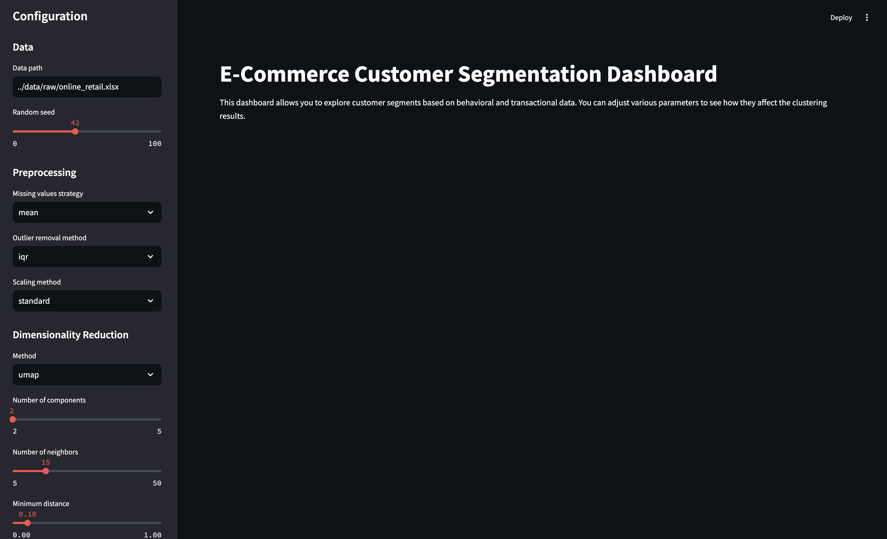

# E-Commerce Customer Segmentation

E-commerce businesses need to understand their customer base to tailor marketing strategies, improve customer experience, and optimize business operations. By segmenting customers into meaningful groups, businesses can:
- Develop targeted marketing campaigns
- Personalize user experiences
- Optimize inventory management
- Improve customer retention strategies

